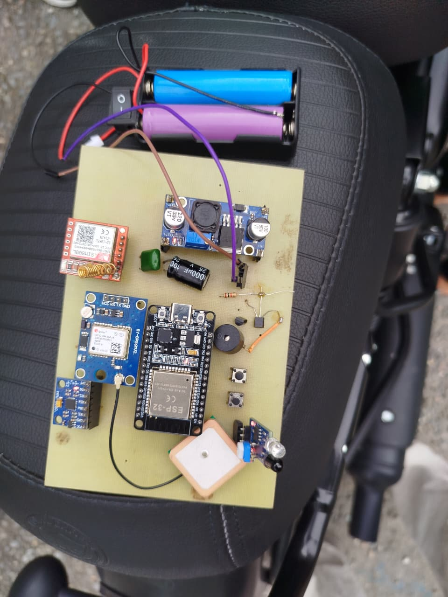
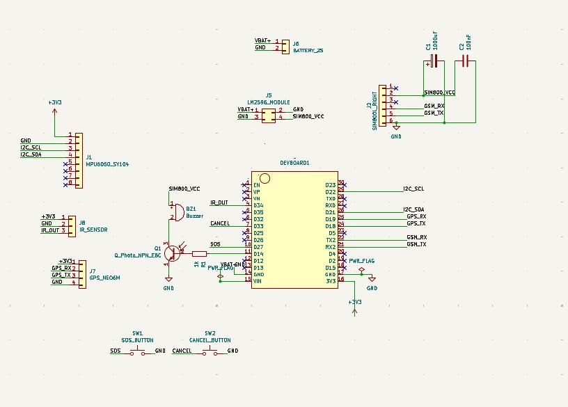
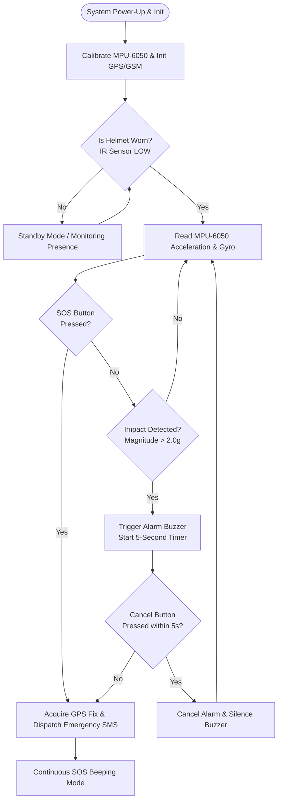

# 🪖 Smart Helmet for Accident Detection and Emergency Alert System

[](https://www.espressif.com/)
[](https://www.arduino.cc/)
[]()
[]()
[]()
[](LICENSE)

An intelligent, IoT-enabled safety helmet engineered on the **ESP32 microcontroller** to provide real-time accident detection, rider presence verification, precise GPS tracking, and automatic emergency SMS dispatch with live Google Maps navigation links.

---

## 📸 System Showcase

<div align="center">
  <table>
    <tr>
      <td align="center" width="50%">
        
        <br />
        <b>Figure 1:</b> Assembled Smart Helmet Prototype with ESP32, MPU-6050, GPS, GSM, and Power Circuitry.
      </td>
      <td align="center" width="50%">
        
        <br />
        <b>Figure 2:</b> Custom PCB Design for Compact In-Helmet Integration.
      </td>
    </tr>
  </table>
</div>

---

## 📌 Table of Contents

- [Overview & Motivation](#-overview--motivation)
- [Key Features](#-key-features)
- [System Architecture](#-system-architecture)
- [Workflow & State Machine](#-workflow--state-machine)
- [Hardware Architecture & Pinout](#-hardware-architecture--pinout)
- [Detection Algorithms & Mathematical Model](#-detection-algorithms--mathematical-model)
- [Firmware Structure](#-firmware-structure)
- [Getting Started & Installation](#-getting-started--installation)
- [Emergency SMS Payload Example](#-emergency-sms-payload-example)
- [Testing & Validation Results](#-testing--validation-results)
- [Future Roadmap](#-future-roadmap)
- [Disclaimer & License](#-disclaimer--license)

---

## 💡 Overview & Motivation

Two-wheeler riders represent one of the most vulnerable traffic demographics globally. In critical road accidents, survival often hinges on the **"Golden Hour"**—the first hour immediately following traumatic injury where prompt medical attention dramatically increases survival rates.

In remote or less populated areas (such as high-altitude and rural roads in **Nepal**), an unconscious or incapacitated rider is unable to call for help.

The **Smart Helmet for Accident Detection and Emergency Alert System** addresses this problem by:
1. **Verifying Helmet Usage**: Uses an optical Infrared (IR) sensor to ensure the helmet is securely worn before enabling active crash detection.
2. **Detecting Sudden Impact & Orientation Loss**: Continuously samples 3-axis acceleration and angular rate through the **MPU-6050 IMU** with custom low-pass filtering and calibration.
3. **Preventing False Positives**: Provides a configurable **5-second grace period** with active buzzer feedback and a manual cancel button.
4. **Autonomous Emergency Broadcast**: Acquires real-time GPS coordinates (latitude, longitude, speed, UTC time) using the **NEO-6M GPS** module and dispatches an emergency SMS via the **SIM800L GSM** module directly to family/emergency services.
5. **Manual SOS Trigger**: Allows the rider to trigger instant distress alerts with a dedicated emergency push button.

---

## ✨ Key Features

- **Multi-Axis Inertial Sensing**: Continuous 6-DOF motion monitoring (acceleration magnitude, roll, and pitch) using MPU-6050.
- **Rider Presence Verification**: Optical IR proximity sensor prevents false triggers when the helmet is carried or set down.
- **Dual UART Integration**: Concurrent Hardware UART channels dedicated for GPS NMEA parsing (UART1) and GSM AT command management (UART2).
- **Grace Period & False Alarm Cancellation**: Audible warning with a 5-second countdown allowing the rider to dismiss accidental triggers.
- **Manual Distress (SOS) Mode**: Dedicated push button for instantaneous emergency broadcasts during roadside emergencies.
- **Live Location Hyperlink**: Generates direct Google Maps URLs (`https://www.google.com/maps?q=lat,lng`) inside the emergency SMS.
- **Isolated Power Regulation**: Dedicated high-current buck conversion (LM2596) delivering stable 4.0V to satisfy SIM800L 2A peak transmission bursts without MCU brownouts.
- **Custom PCB Implementation**: Compact layout designed in KiCad for seamless helmet fitting.

---

## 🏗️ System Architecture

```text
                     +---------------------------------------+
                     |           3.7V Li-ion Battery         |
                     +-------------------+-------------------+
                                         |
                        +----------------+----------------+
                        |                                 |
                        v                                 v
               +-----------------+               +-----------------+
               |  ESP32 Internal |               |  LM2596 Reg.    |
               |  Power Circuit  |               |  (4.0V / 2A)    |
               +--------+--------+               +--------+--------+
                        |                                 |
                        v                                 v
               +-----------------+               +-----------------+
               |   ESP32 (MCU)   |               |   SIM800L GSM   |
               +--------+--------+               +--------+--------+
                        |                                 ^
         +--------------+--------------+                  |
         |              |              |                  | UART (AT Commands)
         v              v              v                  |
   +-----------+  +-----------+  +-----------+            |
   | MPU-6050  |  | IR Sensor |  | Push-     |            |
   | 6-DOF IMU |  | (Presence)|  | Buttons   |            |
   | (I2C)     |  | (GPIO 34) |  | (SOS/     |            |
   +-----------+  +-----------+  |  Cancel)  |            |
                                 +-----------+            |
         +-----------------------------+                  |
         |                             |                  |
         v                             v                  |
   +-----------+                 +-----------+            |
   |  Active   |                 |  NEO-6M   |------------+
   |  Buzzer   |                 | GPS Module| (UART NMEA)
   | (GPIO 14) |                 | (UART)    |
   +-----------+                 +-----------+
```

---

## 🔄 Workflow & State Machine



---

## 🔌 Hardware Architecture & Pinout

The system is configured around standard ESP32 GPIOs and hardware communication buses defined in [`config.h`](file:///E:/Clg/6th%20sem/Minor%20project/code/accident-detection-system/smart_helmet/config.h):

| Peripheral / Module | Interface | ESP32 Pin | Voltage Level | Notes |
|---|---|---|---|---|
| **MPU-6050 (SDA)** | I2C | `GPIO 21` | 3.3V | I2C Data (Address `0x68`) |
| **MPU-6050 (SCL)** | I2C | `GPIO 22` | 3.3V | I2C Clock |
| **NEO-6M GPS (RX)** | UART (Serial1) | `GPIO 19` | 3.3V | ESP32 RX $\leftarrow$ GPS TX |
| **NEO-6M GPS (TX)** | UART (Serial1) | `GPIO 18` | 3.3V | ESP32 TX $\rightarrow$ GPS RX |
| **SIM800L GSM (RX)**| UART (Serial2) | `GPIO 16` | 3.3V / Level-shifted | ESP32 RX $\leftarrow$ GSM TX |
| **SIM800L GSM (TX)**| UART (Serial2) | `GPIO 17` | 3.3V / Level-shifted | ESP32 TX $\rightarrow$ GSM RX |
| **IR Helmet Sensor** | Digital Input | `GPIO 34` | 3.3V | Active LOW when worn |
| **SOS Push Button**  | Digital Input | `GPIO 32` | 3.3V | Internal `INPUT_PULLUP` |
| **Cancel Button**    | Digital Input | `GPIO 33` | 3.3V | Internal `INPUT_PULLUP` |
| **Active Buzzer**    | Digital Output| `GPIO 14` | 3.3V / 5V | Driven via 2N2222 NPN Transistor |

---

## 🧮 Detection Algorithms & Mathematical Model

### 1. Acceleration Magnitude Calculation
Raw acceleration readings from the 3-axis accelerometer are normalized against full-scale sensitivity ($16384\text{ LSB}/g$ for $\pm 2g$):

$$a_x = \frac{\text{Raw}_X}{16384}, \quad a_y = \frac{\text{Raw}_Y}{16384}, \quad a_z = \frac{\text{Raw}_Z}{16384}$$

The total instantaneous acceleration magnitude $\|a\|$ is calculated as:

$$\|a\| = \sqrt{a_x^2 + a_y^2 + a_z^2}$$

An accident event is triggered if $\|a\| > \text{ACCIDENT\_THRESHOLD}$ (default: $2.0g$).

### 2. Digital Low-Pass Filtering
To suppress high-frequency mechanical vibration from the motorcycle engine and road roughness, a discrete first-order Low-Pass Filter (LPF) is applied:

$$y[n] = \alpha \cdot x[n] + (1 - \alpha) \cdot y[n-1]$$

*(where $\alpha = 0.2$ smoothing factor)*

### 3. Tilt & Orientation Angle (Roll & Pitch)
Helmet tilt angle is calculated using trigonometric orientation equations:

$$\text{Roll} = \operatorname{atan2}\left(a_y, \sqrt{a_x^2 + a_z^2}\right) \times \frac{180}{\pi}$$

$$\text{Pitch} = \operatorname{atan2}\left(-a_x, \sqrt{a_y^2 + a_z^2}\right) \times \frac{180}{\pi}$$

---

## 📁 Firmware Structure

```text
accident-detection-system/
├── assets/
│   ├── PCB.jpeg                     # Custom PCB routing and layout image
│   └── Prototype.jpeg               # Breadboard / hardware prototype image
├── smart_helmet/
│   ├── smart_helmet.ino             # Main setup & execution loop
│   ├── config.h                     # Pin definitions, baud rates, and thresholds
│   ├── mpu6050.h / mpu6050.cpp      # IMU driver, calibration, and crash detection
│   ├── gps.h / gps.cpp              # TinyGPS++ NMEA parser and Google Maps URL generator
│   ├── sim.h / sim.cpp              # SIM800L AT command controller & SMS dispatcher
│   ├── IR_sensor.h / IR_sensor.cpp  # Helmet wear detection logic
│   ├── buzzer.h / buzzer.cpp        # Active buzzer warning & alarm tone generation
│   └── button.h / button.cpp        # Debounced SOS and Cancel button interfaces
├── LICENSE                          # Open-source MIT License
└── README.md                        # Documentation
```

---

## 🚀 Getting Started & Installation

### Hardware Requirements
- **ESP32 NodeMCU-32S / ESP-WROOM-32**
- **MPU-6050** 6-Axis Accelerometer & Gyroscope
- **u-blox NEO-6M** GPS Module with ceramic patch antenna
- **SIM800L** GSM/GPRS Module + micro-SIM card (2G SMS enabled)
- **IR Proximity Sensor** (Active LOW)
- **LM2596 DC-DC Step-Down Buck Converter**
- **3.7V / 7.4V Li-ion Battery pack**
- **Active 5V Buzzer** & **2N2222 NPN Transistor**
- Tactile Push Buttons & $1\text{k}\Omega$ resistors

### Software Dependencies
Install the following libraries via the **Arduino Library Manager** (`Sketch` $\rightarrow$ `Include Library` $\rightarrow$ `Manage Libraries`):
1. **TinyGPSPlus** (by Mikal Hart)
2. **Wire** (Built-in ESP32 I2C)

### Flashing the ESP32
1. Clone this repository:
   ```bash
   git clone https://github.com/YugalThapa/accident-detection-system.git
   cd accident-detection-system/smart_helmet
   ```
2. Open [`smart_helmet.ino`](file:///E:/Clg/6th%20sem/Minor%20project/code/accident-detection-system/smart_helmet/smart_helmet.ino) in **Arduino IDE**.
3. Open [`config.h`](file:///E:/Clg/6th%20sem/Minor%20project/code/accident-detection-system/smart_helmet/config.h) and set your emergency contact number:
   ```cpp
   #define EMERGENCY_PHONE "+97798XXXXXXXXX"
   ```
4. Select board: `Tools` $\rightarrow$ `Board` $\rightarrow$ `ESP32 Arduino` $\rightarrow$ **`ESP32 Dev Module`**.
5. Select the correct **COM Port**.
6. Compile and Upload.
7. Open **Serial Monitor** at **`115200 baud`** to observe initialization and calibration telemetry.

---

## 📩 Emergency SMS Payload Example

When an impact is confirmed or the SOS button is triggered, the system dispatches an SMS in the following format:

```text
SMART HELMET EMERGENCY ALERT!
Possible accident detected.

Latitude: 28.256214
Longitude: 83.976852
Time: 14:25:32
Date: 16/08/2026

Location:
https://www.google.com/maps?q=28.256214,83.976852
```

---

## 📊 Testing & Validation Results

| Module / Subsystem | Test Criterion | Result / Observation | Status |
|---|---|---|:---:|
| **ESP32 MCU** | Multi-UART & I2C concurrency | Stable operation at 115200 baud | ✅ PASS |
| **MPU-6050** | I2C Device detection (`0x68`) | Accurate acceleration & angle metrics | ✅ PASS |
| **NEO-6M GPS** | Satellite acquisition & fix | Valid fix achieved with $\pm 2.5\text{m}$ accuracy | ✅ PASS |
| **SIM800L GSM** | AT command handshake & SMS transmission | SMS dispatched within 3-5 seconds | ✅ PASS |
| **IR Wear Sensor**| Object proximity detection | Immediate state transition (`LOW` = Worn) | ✅ PASS |
| **False-Alarm Cancel**| 5s countdown cancellation | Buzzer silences and resets state cleanly | ✅ PASS |
| **Power Stability** | SIM800L burst current handling | No MCU resets during GSM burst transmission | ✅ PASS |

---

## 🔮 Future Roadmap

- [ ] **Sensor Fusion (Kalman / Mahony Filter)**: Combine accelerometer and gyroscope data for advanced dynamic crash posture detection.
- [ ] **Custom PCB Assembly**: Fabricate and solder the KiCad-designed PCB for full in-helmet encasement.
- [ ] **BLE / Companion Mobile App**: Real-time telemetry, battery percentage tracking, and contact management via Bluetooth Low Energy.
- [ ] **Cloud & MQTT Telemetry**: Forward crash telematics to centralized emergency dispatch dashboards.
- [ ] **Alcohol Sensor Integration (MQ-3)**: Implement pre-ignition breathalyzer verification for drunk-driving prevention.

---

## 📄 License & Academic Attribution

This project is licensed under the **MIT License** - see the [LICENSE](LICENSE) file for details.

Developed as an Engineering Minor Project focusing on embedded IoT systems, road safety enhancements, and rapid emergency dispatch in Nepal.
